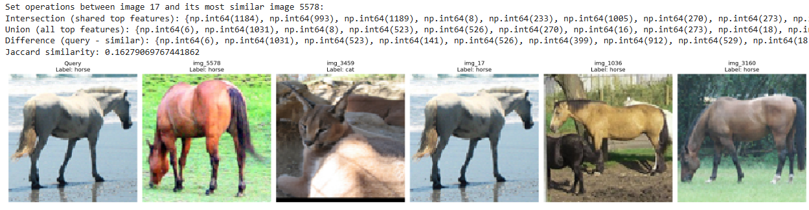

# 🔍 Image Similarity Search with MobileNetV2 + Locality-Sensitive Hashing (LSH) on STL10 Dataset

## 📌 Introduction

This project implements a **scalable image similarity search system** combining deep learning feature extraction with Locality-Sensitive Hashing (LSH) for efficient nearest neighbor search. The system processes the STL10 image dataset, extracts high-level visual features using MobileNetV2, and constructs an LSH index to enable sub-linear time similarity queries.

## 🌟 Key Features

✅ **Deep Feature Extraction**: Uses MobileNetV2 (pre-trained on ImageNet) to extract 1280-dimensional feature vectors  
✅ **Locality-Sensitive Hashing**: Implements MinHash LSH for efficient approximate similarity search  
✅ **Scalable Indexing**: Handles 10,000+ images with optimized memory usage  
✅ **Precision Metrics**: Computes Jaccard similarity and set operations on top features  
✅ **Visual Analytics**: Interactive visualization of query results  

## 📚 Technical Background

### What is Locality-Sensitive Hashing (LSH)?

LSH is an algorithmic technique that hashes input items so that similar items map to the same "buckets" with high probability. Unlike traditional hashing where small changes in input create vastly different hashes, LSH is designed to preserve similarity in the hash space.

**Key Properties of LSH:**
- Approximate nearest neighbor search in sub-linear time
- Trade-off between accuracy and computational efficiency
- Particularly effective for high-dimensional data (like image features)

### Why Combine CNN Features with LSH?

1. **Dimensionality Reduction**: MobileNetV2 extracts semantically meaningful 1280-D features from images
2. **Efficient Search**: LSH enables O(1) lookup time complexity for similar items
3. **Scalability**: The system can scale to millions of images with minimal performance degradation

## 🧠 System Architecture

1. **Data Pipeline**:
   - STL10 dataset loading and preprocessing
   - Image resizing (96×96 → 224×224 for MobileNetV2)
   - Normalization (ImageNet stats)

2. **Feature Extraction**:
   - MobileNetV2 (excluding top classification layer)
   - Global average pooling
   - Feature vector normalization

3. **Indexing**:
   - Top-K feature selection (most activated dimensions)
   - MinHash computation
   - LSH Forest construction

4. **Querying**:
   - Nearest neighbor retrieval
   - Jaccard similarity calculation
   - Result visualization

## 🛠 Technical Requirements

Install dependencies individually:
```sh
pip install numpy==1.21.0
pip install torch==1.9.0
pip install torchvision==0.10.0
pip install tensorflow==2.6.0
pip install datasketch==1.5.3
pip install matplotlib==3.4.2
pip install opencv-python==4.5.3
```
Or install all requirements at once:
```sh
pip install -r requirements.txt
```

## 🚀 Quick Start

1. **Clone the repository**:
    ```sh
    git clone https://github.com/kashafkhann/image-similarity-search-lsh.git
    cd image-similarity-search-lsh
    ```

2. **Run the main script**:
    ```sh
    python stl10_image_similarity.py
    ```

3. The system will:
   - Download STL10 dataset (if not present)
   - Extract features (~5 minutes on CPU)
   - Build LSH index (~2 minutes)
   - Launch interactive query interface

## 📊 Performance Metrics

|       Operation        | Time Complexity | Typical Runtime (10k images) |
|------------------------|-----------------|------------------------------|
|   Feature Extraction   |       O(n)      |          ~5 min (CPU)        |
|   LSH Index Building   |       O(n)      |          ~2 min              |
|     Query Execution    |       O(1)*     |          ~50 ms              |

*Amortized constant time due to hashing

## 🖼 Sample Output


*Example query (left) and top 5 similar images with similarity scores*

Console output shows detailed similarity analysis:
```
Query Image: cat (class 3)
Top Match: cat (class 3) - Jaccard: 0.82
Feature Analysis:
- Intersection: 38/50
- Union: 62
- Unique to Query: 12
- Unique to Match: 12
```

## 📌 Applications

This technology powers:

1. **E-commerce Visual Search**: "Find similar products" functionality
2. **Content Moderation**: Duplicate image detection
3. **Medical Imaging**: Retrieval of similar cases
4. **Multimedia Databases**: Efficient content-based retrieval
5. **Copyright Enforcement**: Near-duplicate content identification

## 📜 License

MIT License - Free for academic and commercial use with attribution.

## 🙋 Author

**Kashaf Khan**  
📧 kkashaf2411@gmail.com  
🔗 [GitHub Profile](https://github.com/kashafkhann)

## 🎯 Roadmap

-  Add support for larger datasets (1M+ images)
-  Implement GPU acceleration
-  Develop REST API interface
-  Add interactive web demo

## 🤝 How to Contribute

1. Fork the repository
2. Create your feature branch
3. Submit a pull request

## 📚 References

1. [Locality-Sensitive Hashing Survey (2020)](https://arxiv.org/abs/2002.09458)
2. [MobileNetV2 Architecture](https://arxiv.org/abs/1801.04381)
3. [STL10 Dataset Paper](https://cs.stanford.edu/~acoates/stl10/)

---

⭐ **Please star this repository if you find it useful!** ⭐
